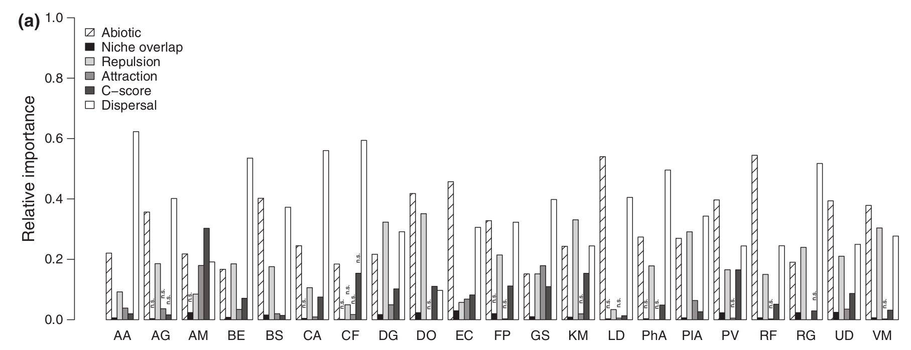
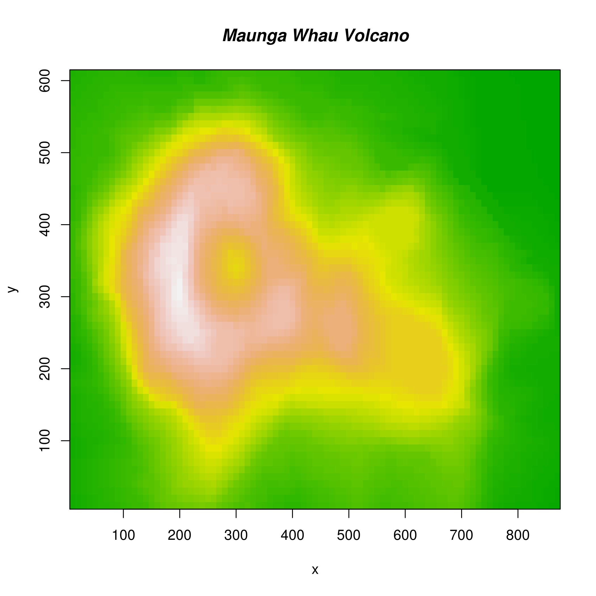

# Séance 5

- Ces diapositives sont disponibles en [version web](https://econumuds.github.io/BIO500/cours4/) et en [PDF](./assets/pdf/S4-BIO500.pdf).
- L'ensemble du matériel de cours est disponible sur la page du portail [moodle](https://www.usherbrooke.ca/moodle2-cours/course/view.php?id=12189).

<!-- TODO 1: Mettre cours 2 en PDF -->
<!-- TODO 2: Changer le lien moodle -->
--- .transition

# Qu'est-ce qui fait une bonne figure ?

---

# Trop d'information

<div style='text-align:center;margin-top:10px;'>
  </img>
</div>

---

# Npn respect de normes graphiques

<div style='text-align:center;margin-top:10px;'>
  </img>
</div>

---

# Abus de symboles et de couleurs

<div style='text-align:center;margin-top:10px;'>
  </img>
</div>

---

# Lecture en 3 dimensions


--- .transition

# Introduction

--- 

# L'importance des figures

- Sommaire visuel des données
- Plus efficace qu'un tableau
- Utile pour l'exploration de données
- Essentiel pour la présentation de résultats

--- 

# Mais attention

- Une mauvaise figure peut vous mentir
- Une figure n'est pas toujours la solution

--- 

# Mais attention

<div style='text-align:center;margin-top:10px;'>
  </img>
</div>

--- 

# Mais attention

<div style='text-align:center;margin-top:10px;'>
  </img>
</div>

--- 

# Mais attention

<div style='text-align:center;margin-top:10px;'>
  </img>
</div>

--- 

# Objectifs d'une figure

- Communiquer
- Explorer des données
- Accompagner des analyses statistiques

--- 

# Quelques règles de base

- Chaque élément d'une figure doit aider à comprendre les données
- Chosir le type de représentation qui met en valeur ce qui doit être montré
- Attention aux normes graphiques (choix des couleurs, taille des caractères, épaisseur de la ligne, disposition des marges, cadrage)

--- 

# Types de figures

## Diagramme de dispersion (Scatter plot)


```
## Warning in file(file, "rt"): cannot open file 'pres/donnees/arbres.csv': No
## such file or directory
```

```
## Error in file(file, "rt"): cannot open the connection
```

```
## Error in table(arbres[, c(3, 5)]): object 'arbres' not found
```

```
## Error in row.names(densite): object 'densite' not found
```

```
## Error in plot(elevation, densite[, 1], pch = 19, xlab = "Elevation", ylab = "Densité"): object 'elevation' not found
```

```
## Error in points(elevation, densite[, 3]): object 'elevation' not found
```

---

# Types de figures

## Diagrammes à bâtons (Bar plot)


```
## Warning in file(file, "rt"): cannot open file 'arbres.csv': No such file or
## directory
```

```
## Error in file(file, "rt"): cannot open the connection
```

```
## Error in table(arbres$esp): object 'arbres' not found
```

```
## Error in barplot(n_tot): object 'n_tot' not found
```

---

# Types de figures

## Histogrammes


```
## Error in hist(densite[, 3]): object 'densite' not found
```

--- &twocol

# Types de figures

## Représentation 3-D



---

# Types de figures

## Lignes de contour


```
## Error in contour.default(x, y, volcano, levels = seq(90, 200, by = 5), : plot.new has not been called yet
```

--- .transition

# Faire une figure étape par étape avec R

--- 

# Prépares les données adéquatement
- Habituellement un data.frame ou une matrice
- Une observation par ligne

--- &twocol

# Ouvrir une fenêtre graphique

*** =left

```r
dev.new(width = 10, height = 7)
```

*** =right


--- &twocol

# Fixer certains paramètres


```r
# Fixer la largeur et la hauteur des marges
par(mar = c(5,6,2,1))

# Fixer le nombre de figures en colonnes et rangées
par(mfrow = c(1,1))
```

*** =right


--- &twocol

# Démarrer une figure avec plot()

*** =left

```r
arbres <- read.csv2("pres/donnees/arbres.csv")
densite <- table(arbres[,c(3,5)])
elevation <- as.numeric(row.names(densite))
plot(elevation, densite[,1], axes = FALSE, xlab = "Élévation", ylab = "Densité")
```

*** =right

```
## Warning in file(file, "rt"): cannot open file 'pres/donnees/arbres.csv': No
## such file or directory
```

```
## Error in file(file, "rt"): cannot open the connection
```

```
## Error in table(arbres[, c(3, 5)]): object 'arbres' not found
```

```
## Error in row.names(densite): object 'densite' not found
```

```
## Error in plot(elevation, densite[, 1], axes = FALSE, xlab = "Élévation", : object 'elevation' not found
```

--- &twocol

# Échelles logarithmiques

*** =left

```r
plot(elevation, densite[,1], axes = FALSE, xlab = "Élévation", ylab = "Densité", log = "xy")
```

*** =right

```
## Error in plot(elevation, densite[, 1], axes = FALSE, xlab = "Élévation", : object 'elevation' not found
```

--- &twocol

# Ajuster les tailles de caractères
## Arguments 'cex', cex.lab' et 'cex.axis'

*** =left

```r
plot(elevation, densite[,1], axes = FALSE, xlab = "Élévation", ylab = "Densité", cex.lab = 1.5, cex.axis = 1.25, cex = 1.5)
```

*** =right

```
## Error in plot(elevation, densite[, 1], axes = FALSE, xlab = "Élévation", : object 'elevation' not found
```

--- &twocol 

# Modifier les axes

*** =left

```r
axis(1, seq(0,1000,100))
axis(2)
```

*** =right

```
## Error in axis(1, seq(0, 1000, 100)): plot.new has not been called yet
```

```
## Error in axis(2): plot.new has not been called yet
```

--- &twocol 

# Ajouter un titre

*** =left

```r
title(main = "Densité au long du gradient d'élévation")
```

*** =right

```
## Error in title(main = "Densité au long du gradient d'élévation"): plot.new has not been called yet
```

--- &twocol 

# Superper des points d'une autre série de données

*** =left

```r
points(elevation, densite[,3], pch = 19, cex = 1.5)
```

*** =right

```
## Error in points(elevation, densite[, 3], pch = 19, cex = 1.5): object 'elevation' not found
```

--- &twocol 

# Superposer des lignes

*** =left

```r
lines(elevation, densite[,1],lty = 1, lwd = 1.5)
lines(elevation, densite[,3], lty  = 3, lwd = 1.5)
```

*** =right

```
## Error in lines(elevation, densite[, 1], lty = 1, lwd = 1.5): object 'elevation' not found
```

```
## Error in lines(elevation, densite[, 3], lty = 3, lwd = 1.5): object 'elevation' not found
```

--- &twocol 

# Ajouter une ligne de tendance

*** =left

```r
model = lm(densite[,3]~elevation)
summary(model)
abline(model, col = "darkred")
```

*** =right

```
## Error in eval(expr, envir, enclos): object 'densite' not found
```

```
## Error in summary(model): object 'model' not found
```

```
## Error in abline(model): object 'model' not found
```


--- &twocol 

# Ajouter une légende

*** =left

```r
legend("top", bty = "n", pch = c(19,1), lty = 1, legend = c("Érable à sucre", "Sapin baumier"), cex = 2)
```

*** =right

```
## Error in strwidth(legend, units = "user", cex = cex, font = text.font): plot.new has not been called yet
```

--- &twocol 

# Ajouter du texte

*** =left

```r
r2 <- round(summary(model)$r.squared, 2)
text(x = 850, y = 25, paste(expression(R^2 ==), r2), cex = 2)
```

*** =right


